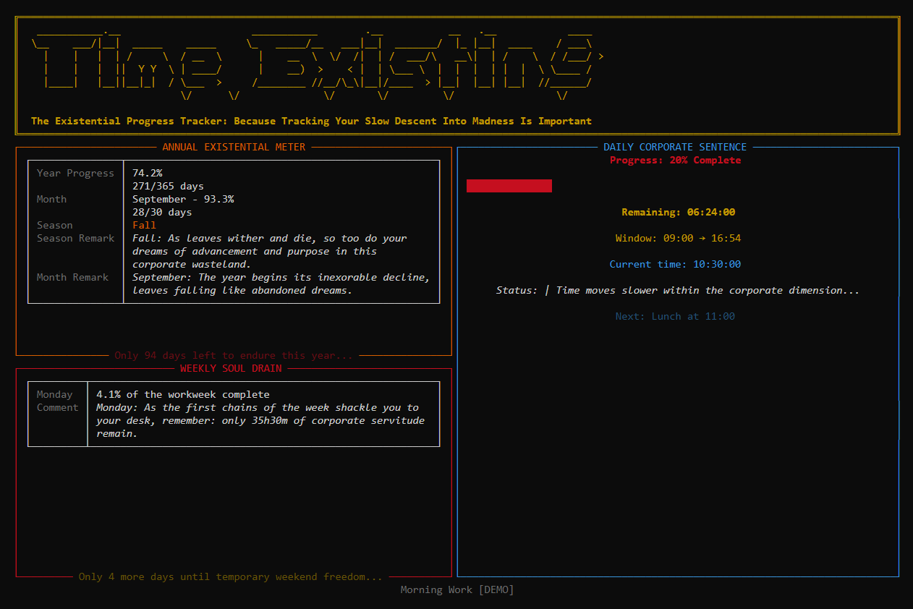

:PROPERTIES:
:ID:       9f4c2d71-6a38-4e05-b1c7-2d90ef53a4c1
:END:
#+TITLE: timeexisting
#+DATE: 2026-09-17
#+FILETAGS: :python:timeexisting:

[[https://github.com/gsaronni/timeexisting/actions/workflows/ci.yml][https://github.com/gsaronni/timeexisting/actions/workflows/ci.yml/badge.svg]] [[https://www.python.org/downloads/][https://img.shields.io/badge/python-3.14-blue.svg]]

A flextime tracker for the terminal that counts your working week and has nothing encouraging to say about it.

/The dashboard in =te --demo=, which cycles through fixed moments of an invented week. No real data appears./

* What it is and why

=timeexisting= (command =te=) tracks a flextime working week against a fixed contract: 37 hours, a start somewhere between 08:00 and 09:00, a 30 minute unpaid lunch, and unlimited paid breaks. It exists to answer one question, "am I above or below my hours, this week and overall", and it presents everything through a deliberately bleak presentation layer: every line of commentary comes from a voice pack whose register is cynical, dystopian and fond of reminding you that nothing you do here matters.

It began as four lines of PowerShell that hibernated a laptop at 18:00. It is being rebuilt in phases into a proper tracker, and that original behaviour will return as a feature. It is a personal instrument: never a timesheet, never submitted, never defended.

* Features

As of phase 2:

- *Dashboard.* A full-screen Rich view of the year, the week and the day: progress through the working day, time remaining, the next lunch or end, the working time left in the week, and seasonal, monthly and weekday commentary.
- *Schedule model.* The day is built from your start time and the contract: a morning block, the lunch window, an afternoon block, and a nominal end at start plus 7h24m plus lunch. Day flags (=no-lunch=, =half-day=, =sick=, =offsite=, =afspadsering=, =fri=) reshape or replace the day.
- *Headless collector.* =te collect= records the machine's presence as transitions in an append-only JSONL ledger, one shard per machine. Every 30 seconds it overwrites a checkpoint instead of writing to the ledger, so a crash is recovered as an inferred stop accurate to one tick, and a jump in the clock is recorded as a suspend and resume.
- *Clean session end on Windows.* Signing out, restarting or shutting down writes a clean stop before the process dies.
- *One collector per machine.* A lockfile checks both the process id and the process start time, so a recycled pid cannot pass for a live collector, and a stale lock is reclaimed silently.
- *The viewer starts the collector.* =te= starts a detached collector if none is running and reports it in the footer. A Startup shortcut starts it at every logon.
- *Start-time suggestion.* The start-time prompt offers today's first recorded presence as its default.
- *Time travel and demo.* =--at= runs the dashboard at any moment; =--demo= cycles through every phase of the day and every month.
- *Content packs.* Every user-visible string comes from a voice pack and every colour from a palette.

Not yet: lock and sleep detection from the operating system, the 37 hour balances, the end-of-day sleep action, statistics and the ledger editor. See the roadmap below.

* Architecture

Two processes and no IPC. The collector runs headless from login, writes transitions to the append-only ledger, and keeps its liveness in a checkpoint file that is state, not ledger. The viewer replays the ledger into a timeline and renders the day. The only shared state is files on disk. Underneath, the schedule model and the resolver are pure: they never read a clock or touch I/O, and =now= is always a parameter, which is what lets the dashboard run at any moment in the past or future.

#+begin_src text
  te collect  (headless, from login)             te  (viewer)
  ----------------------------------             -----------------------------------
  tick every 30 s --> checkpoint-{host}.json     config.toml --> schedule (pure)
       |                                                            |
       | start / stop / suspend / resume                            v
       v                                         ledger --replay--> resolver (pure)
  ledger/{host}.jsonl  (append-only, fsync) ---> timeline           |
                                                                    v
                                                              Rich dashboard
#+end_src

The full specification is =docs/timeexisting-roadmap.org=: that file is the contract, this one is the front door.

* Install

Python 3.14 or later. Windows with PowerShell 7 is the primary platform, and the only one with session-end handling and the Startup shortcut. Linux is secondary and supported for tracking.

#+begin_src powershell
git clone https://github.com/gsaronni/timeexisting.git
cd timeexisting
python -m venv .venv
.\.venv\Scripts\Activate.ps1
pip install -e ".[dev,windows]"
te --help
#+end_src

To start the collector at every logon, run this once (=-WhatIf= to preview, =-Uninstall= to remove):

#+begin_src powershell
pwsh scripts\install-startup.ps1
#+end_src

* Usage

| Command | What it does |
|---|---|
| =te= | Open the dashboard. Asks for today's start time, offering today's first recorded presence as the default, and starts a collector if none is running. |
| =te --start 08:30= | Open the dashboard with the start time given, skipping the prompt. |
| =te --flag half-day= | Apply a day flag; may be repeated. |
| =te --at "2026-09-17 10:30"= | Run the dashboard at a fixed Europe/Copenhagen moment. Starts no collector. |
| =te --demo= | Cycle through fixed moments: every phase of the day, both weekend days, every month. Starts no collector. |
| =te --no-collector= | Open the dashboard without starting a collector. |
| =te collect= | Run the collector in the foreground. Ctrl+C stops it cleanly. |
| =te collect status= | Report the running collector's pid, host and start time, or that none is running. |
| =te collect stop= | Ask the running collector to stop and wait for it. |
| =te config path= | Print where the config file is read from. |
| =te config init= | Write the packaged defaults there, if no file exists yet. |
| =te config check= | Load and validate the config. |

Ctrl+C leaves the dashboard; the collector keeps running.

* Configuration

The packaged defaults describe the contract above. Your own =config.toml= is an overlay: it needs only the keys that differ from the defaults, and everything else keeps its default value. Unknown keys are an error, and the program never rewrites the file. =te config path= shows where it lives (=%APPDATA%\timeexisting\config.toml= on Windows, =~/.config/timeexisting/config.toml= on Linux).

A commented starting point is in [[file:examples/config.toml][examples/config.toml]]: copy it to the path =te config path= prints and edit it. For example, to mark one machine as work and move the default start to 08:30:

#+begin_src toml
[credit]
default_start = 08:30:00

[profiles]
hosts = { "MY-LAPTOP" = "work" }
#+end_src

=te config init= writes the full defaults as a starting point; delete whatever you do not change. =te config check= validates the result.

* Multiple machines

The repository carries the program, not your data. Config lives in =%APPDATA%\timeexisting\= (=~/.config/timeexisting/= on Linux) and the ledger, lockfiles and diagnostic logs in =%LOCALAPPDATA%\timeexisting\= (=~/.local/state/timeexisting/=), per machine.

To share one config and one ledger across devices, point these at a folder you sync yourself:

| Variable | Overrides |
|---|---|
| =TIMEEXISTING_CONFIG_DIR= | the config directory, holding =config.toml= |
| =TIMEEXISTING_STATE_DIR= | the state directory, holding =ledger\=, =logs\= and the lockfiles |

Every per-machine file in the state directory carries the host in its name: the ledger shard (=ledger\<host>.jsonl=), the lockfiles, the checkpoint, the stop file and the diagnostic logs. Machines sharing one synced state directory therefore never write to the same file.

* Roadmap

Each phase leaves the program working. The specification for all of them is =docs/timeexisting-roadmap.org=.

| Phase | Content | Status |
|---|---|---|
| 0 | Migrate the original script into a package, fix its defects, clock protocol, content packs, theme | complete |
| 1 | Configuration, schedule model, resolver, =--at=, day flags | complete |
| 2 | Collector, ledger, replay, lockfile, logging, Windows session end, Startup shortcut | complete |
| 3 | Sleep and lock detection, event log, recovery | planned |
| 4 | Flex balances, holiday calendar, leave, drift, absence classification | planned |
| 5 | End-of-day sleep action, countdown, postponement | planned |
| 6 | =te stats=, histograms | planned |
| 7 | =te edit=, corrections without hand-editing the ledger | planned |
| 8 | Demo on a scaled clock, notifications, key help, full content pass | planned |
| 9 | Additional voices, palettes and locales | planned |

* Development

#+begin_src powershell
pre-commit install
ruff format .
ruff check .
pytest
#+end_src

All three pass before every commit, and the pre-commit hooks run the formatter and the linter on each one. CI runs the linter and the test suite on Windows and Ubuntu. An architecture test enforces the purity rule: nothing under =domain/= may import Rich, read a clock or touch I/O.

* How it was built

=timeexisting= was built with [[https://claude.com/claude-code][Claude Code]]. Each phase was first specified as a prompt, kept in =docs/= as =phase-N-prompt.md=, against the roadmap in =docs/timeexisting-roadmap.org=. Claude Code implemented it one step at a time, stopping after each step for review before the next began. =docs/logs.org= records every phase: what was asked, what was done, what was rejected, what was observed and what carried over.

* Licence

MIT. See [[file:LICENSE][LICENSE]].

The MIT licence covers the code only. The ASCII art in =src/timeexisting/assets/ascii_art/= is excluded: the artworks remain the property of their artists and are included for personal, non-commercial use under the [[https://www.asciiart.eu/terms-of-use][asciiart.eu Terms of Use]], with their names and initials intact. See [[file:CREDITS.org][CREDITS.org]] for each piece's source and artist.
